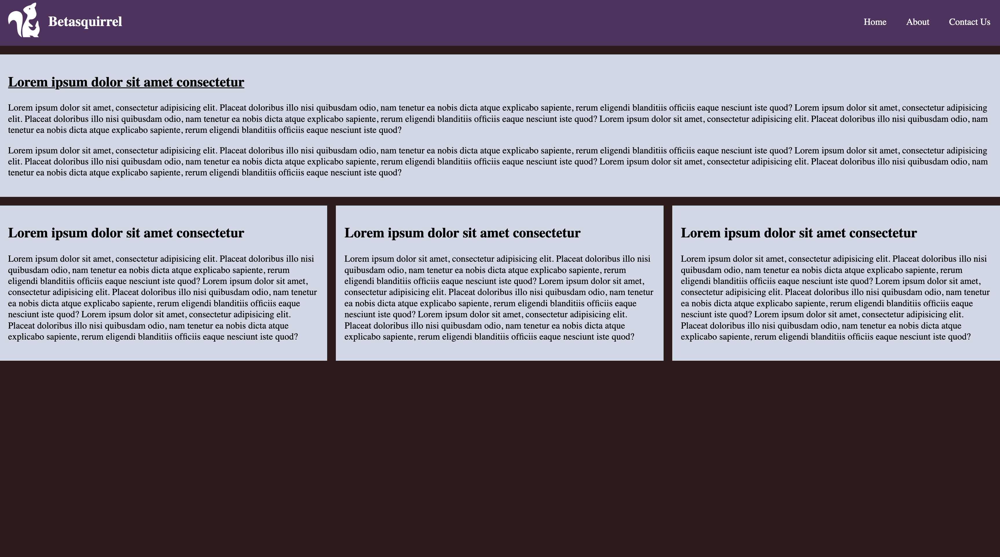
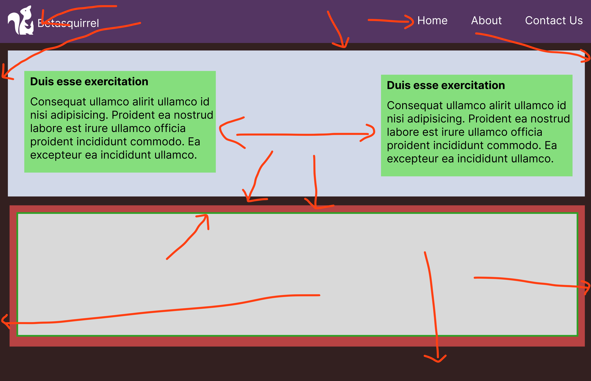
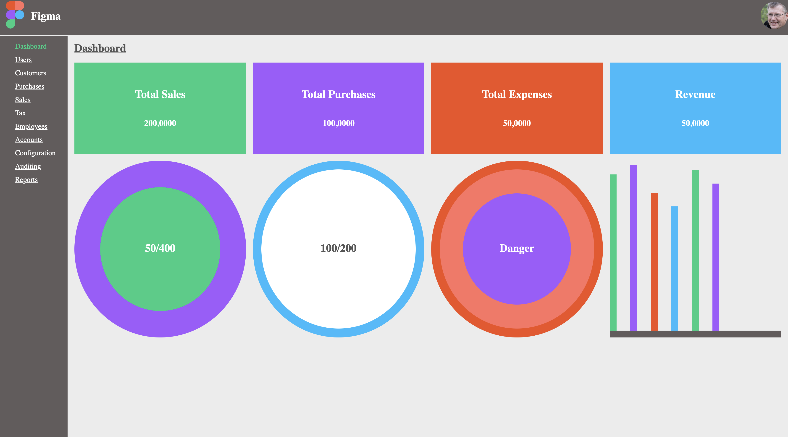

# betasquirrel-tasks

Assignments from betasquirrel

## Demo

[Live](https://anshad.github.io/betasquirrel-tasks/)

## Profile Links

- [GitHub](https://github.com/anshad)
- [StackOverflow](https://stackoverflow.com/users/1926343/anshad-vattapoyil)
- [LinkedIn](https://www.linkedin.com/in/anshadvp/)

## Design Tasks

| Requirements                  | Output                              |
| ----------------------------- | ----------------------------------- |
|  |  |
|   |  |
|  |  |

### Text Formatting

Laboris **exercitation dolor cupidatat mollit anim ex** non _culpa aliqua_ labore eiusmod fugiat. Aliqua quis sit nulla ~~nostrud occaecat~~ velit cillum voluptate id. Elit est do adipisicing nisi adipisicing fugiat tempor fugiat consectetur. Consectetur reprehenderit in dolor et anim. Quis qui ea culpa aliqua sit cillum adipisicing Lorem.

`this is a highlighted code`

## Linux Commands

- `cd` - Change current directory. Ex: `cd Desktop`, `cd ..`, `cd`, `cd /`
- `ls` - List contents of a directory, Ex: `ls -a` lists hidden files as well.
- `pwd` - Display current working directory path
- `cat` - Display contents of a file. Ex: `cat README.md`
- `ssh-keygen` - generate ssh key. Ex: `ssh-keygen -t ed25519 -C "myemail@gmail.com"`
- `mkdir` - create folder. Ex: `mkdir test`
- `rm` - remove file or folder. Ex: `rm my-file.txt`, `rm -rf my-folder`
- `clear` - clear terminal

## Git Commands

1. `git config` Configure git user. Ex: `git config --global user.name "myusername"`, `git config user.email "myemail@gmail.com"`
2. `git clone` Clone a remote git repo to your local. Ex: `git clone https://github.com/anshad/betasquirrel-tasks.git`, `git clone https://github.com/anshad/betasquirrel-tasks.git new-folder`
3. `git add` Add your file changes to git. Ex: `git add .`, `git add README.md`
4. `git commit` Commit changes to git. Ex: `git commit -m "Initial commit"`
5. `git push` Push your local commits to remote repo. Ex: `git push origin main`
6. `git config --list` - to see the config added
7. `git reset --hard` - remove all changes
8. `git status` - to see the current changes as list
9. `git diff` - see the changes on each file
10. `git log` - see commit history
11. `git stash` - stash your uncommitted changes

## Reading Tasks

Read the below pages and attend the tests, then upload test result screenshot on readme.

- [HTML](https://www.w3schools.com/html/default.asp)
- [Intro](https://www.w3schools.com/html/html_intro.asp)
- [Editors](https://www.w3schools.com/html/html_editors.asp)
- [Basic](https://www.w3schools.com/html/html_basic.asp)
- [Elements](https://www.w3schools.com/html/html_elements.asp)
- [Attributes](https://www.w3schools.com/html/html_attributes.asp)
- [Headings](https://www.w3schools.com/html/html_headings.asp)
- [Paragraphs](https://www.w3schools.com/html/html_paragraphs.asp)
- [Styles](https://www.w3schools.com/html/html_styles.asp)
- [Formatting](https://www.w3schools.com/html/html_formatting.asp)
- [Quotations](https://www.w3schools.com/html/html_quotation_elements.asp)
- [Comments](https://www.w3schools.com/html/html_comments.asp)
- [Colors](https://www.w3schools.com/html/html_colors.asp)
- [RGB](https://www.w3schools.com/html/html_colors_rgb.asp)
- [HEX](https://www.w3schools.com/html/html_colors_hex.asp)
- [HSL](https://www.w3schools.com/html/html_colors_hsl.asp)
- [CSS](https://www.w3schools.com/html/html_css.asp)
- [Links](https://www.w3schools.com/html/html_links.asp)
- [Link Colors](https://www.w3schools.com/html/html_links_colors.asp)
- [Link Bookmarks](https://www.w3schools.com/html/html_links_bookmarks.asp)
- [Images](https://www.w3schools.com/html/html_images.asp)
- [Image Map](https://www.w3schools.com/html/html_images_imagemap.asp)
- [Background Images](https://www.w3schools.com/html/html_images_background.asp)
- [Picture](https://www.w3schools.com/html/html_images_picture.asp)
- [Favicon](https://www.w3schools.com/html/html_favicon.asp)
- [Tables](https://www.w3schools.com/html/html_tables.asp)
- [Table Borders](https://www.w3schools.com/html/html_table_borders.asp)
- [Table Sizes](https://www.w3schools.com/html/html_table_sizes.asp)
- [Table Headers](https://www.w3schools.com/html/html_table_headers.asp)
- [Padding & Spacing](https://www.w3schools.com/html/html_table_padding_spacing.asp)
- [Colspan & Rowspan](https://www.w3schools.com/html/html_table_colspan_rowspan.asp)
- [Table Styling](https://www.w3schools.com/html/html_table_styling.asp)
- [Table Group](https://www.w3schools.com/html/html_table_colgroup.asp)
- [HTML List](https://www.w3schools.com/html/html_lists.asp)
- [Unordered List](https://www.w3schools.com/html/html_lists_unordered.asp)
- [Ordered List](https://www.w3schools.com/html/html_lists_ordered.asp)
- [Other Lists](https://www.w3schools.com/html/html_lists_other.asp)
- [Block & Inline](https://www.w3schools.com/html/html_blocks.asp)
- [Classes](https://www.w3schools.com/html/html_classes.asp)
- [ID](https://www.w3schools.com/html/html_id.asp)
